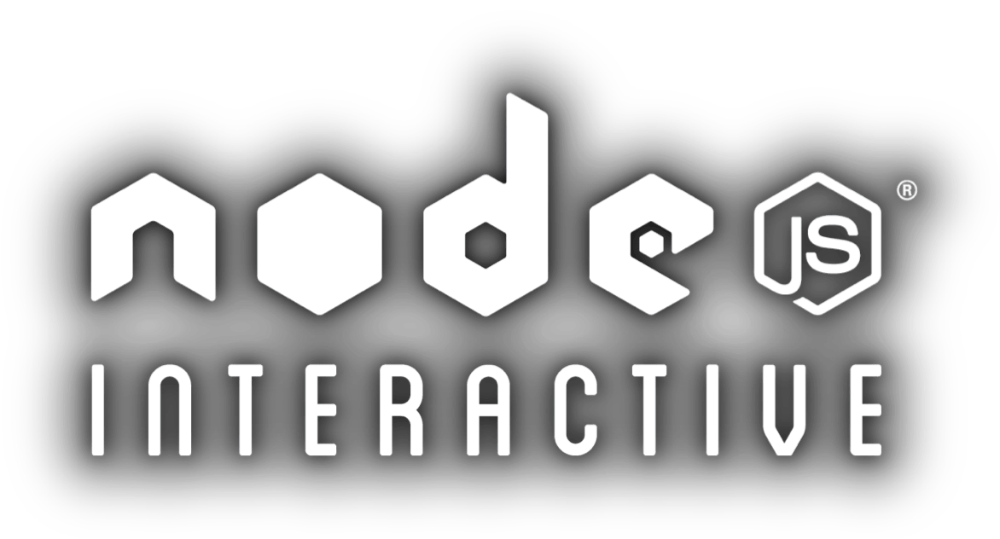

background-image: url(img/node1.png)
class: center, middle, whitedrop

.centersml[]

# Node.js Intl: Where we are, what’s next
## Steven R. Loomis 
## IBM Global Foundations Technology Team
### [ibm.biz/srloomis](http://ibm.biz/srloomis)  &nbsp; @srl295
???
Welcome to this presentation on Node internationalization
---

# `whoami`

- IBM Global Foundations Technology Team
???
I’ve been a part of this group for about 20 years. 

The name is new but the team is not. We research, design, and create standards-based technologies 
and best practices IBM needs to rapidly deploy solutions to a global audience.
And in order to do so I am…
--

- IBM’s [ICU4C](http://icu-project.org) lead
???
… the technical lead for the International Components for Unicode for C/C++ as well as
--

- Rep: [Unicode TC](http://unicode.org) / Chair: [ULI-TC](http://unicode.org/uli) / [CLDR](http://unicode.org/cldr)
???
IBM's primary rep to the Unicode TC, chair of the Localization Interoperability TC,
and member of the Common Locale Data Repository.
But specific to this group, I am the
--

- Node [Intl WG](https://github.com/nodejs/Intl) Facilitator
???
Facilitator of the Intl working group
--

- [Globalization Pipeline](https://www.ng.bluemix.net/docs/services/GlobalizationPipeline/index.html) on Bluemix
???
I also work on a new product called the Globalization Pipeline, you can try it
out in beta on Bluemix
--

---

# 2010: [ECMA-402 1st ed.](http://www.ecma-international.org/ecma-402/1.0/)
???
ECMA-402 is the Internationalization API - as distinct from
ECMA-262 which is the ECMAScript (or JavaScript) language
--

- IETF BCP 47 Language Tag ( en-US vs. fr-CH …) 
- Collation (sorting)
- Number Format (1,234.56 vs 1.234,56)
- Date Format (Oct 28, 2015 vs 10 de oct. de 2015)
--

- Support in Chrome, Firefox, IE/Edge, Opera. 
???
Did I miss any platforms?
--

- WebKit (Safari) [WIP](http://bit.ly/WebKitIntl)
???
Thank you Andy Van Wagoner
---

# 2015: 2nd ed

- Editorial
- Array.toLocaleString()
--

- https://github.com/tc39/ecma402
???
Standards Development moves to GitHub
---

# “`Intl`”
???
Why do we call this Intl?
--

- Global object Intl:
 - `Intl.Collator` (sorting)
--

 - `Intl.DateTimeFormat`
--

 - `Intl.NumberFormat`
--

- Other objects:
 - `Date().toLocaleString()`
--

 - `Number().toLocaleString()`
--

 - `"abc".localeCompare("ábc")`
--

 - `"u¨".normalize("NFC")			=== "ü"`
--

 - `"i".toLocaleUpperCase()` / `"I".toLocaleLowerCase()` (not implemented fully)
???
Needed for Turkish, not implemented yet.
---

# Intl in Node.js

- 2012: ECMA-402 standardized. Google v8-i18n project starts.
--

- 2013: v8-i18n integrated into v8 codebase
--

- 2014: Available as a compile option in node.js. Packaging work merged into v0.12 branch.
--

- 2015 Feb 6: “Intl” enabled in node.js [v0.12](http://blog.nodejs.org/2015/02/06/node-v0-12-0-stable/) downloads!
--

- (io.js fork didn’t include Intl between 1.0.0 and 3.0.x… 
--

- … but reappeared in 3.1.0!)
--

- 2015 October:Experimental `full-icu` npm module / discussion about auto discovery [#3460](https://github.com/nodejs/node/issues/3460)
---

# Node Intl “Stack”

- node (You are here)
--

- v8
--

- [ICU](http://icu-project.org) (Implements Unicode/Formatting functions)
--

- [CLDR](http://unicode.org/cldr) (Source of data to drive formatting/collating)
---

# Intl WG

- https://github.com/nodejs/Intl
.gftt[]
--

- First Meeting: August 11, 2015
--

- Scope:
  - Functionality &amp; compliance (standards: ECMA, Unicode…)
???
Ecma402 editor a member
--

  - Support for Globalization and Internationalization issues that come up in the tracker
--

  - Guidance and Best Practices
--

  - Refinement of existing Intl implementation
???
Like to thank the community…
Challenges
Getting acquainted with a new community
GitHub, IRC, introductions, face to face at conferences… all help.

---

# How do you use the Intl features

- Download Node 0.12+
???
(of course, you want to use 4.2 LTS or 5…
--

- Use `.toLocaleString()` instead of `.toString()` on `Number` and `Date`
--

- Use `"foo".localeCompare("bar")` instead of &lt; / &gt; / ==
--

- visit MDN Intl: 
.shortlink[[mzl.la/1OSOtvf](https://developer.mozilla.org/en-US/docs/Web/JavaScript/Reference/Global_Objects/Intl)]
???
A great resource
---

# What’s next for ECM402?

- https://github.com/tc39/ecma402/
--

- 3rd edition: 2016?
--

- Possible features:
 - Plural rules
 - Units
 - Locale services
 - Unicode data
 - Regex improvements
 - Token formatting
---

# What's next for the Intl WG?

- Improve documentation
--

- Make it easier to locate full ICU support (not just English) [#3460](https://github.com/nodejs/node/issues/3460)
--

- Localization for Node and modules
???
Discuss best practices around 
--

- Outreach to user communities
--

- Data packaging / loading
---

# Thanks / Q&amp;A

- Social: @srl295
- Email: srloomis at us.ibm.com
- Slides/Contact @  http://ibm.biz/srloomis 
- Node Intl WG:   http://github.com/nodejs/Intl 

.bottom[made with [remark.js](http://remarkjs.com) • fork me on [GitHub](https://github.com/srl295/srl295-slides/tree/2015-12-NodeInteractive)]

