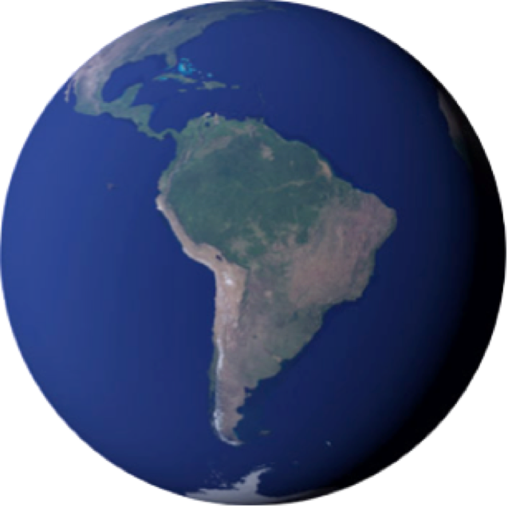
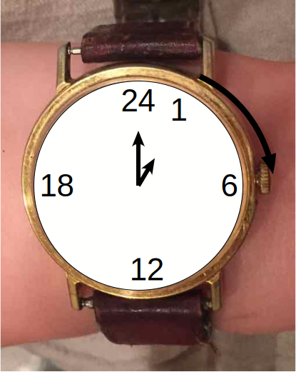
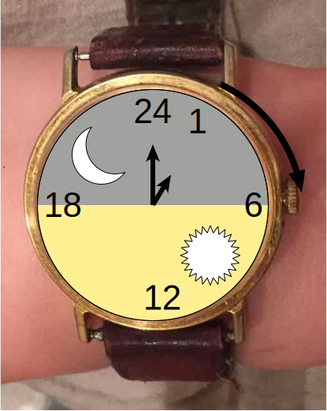
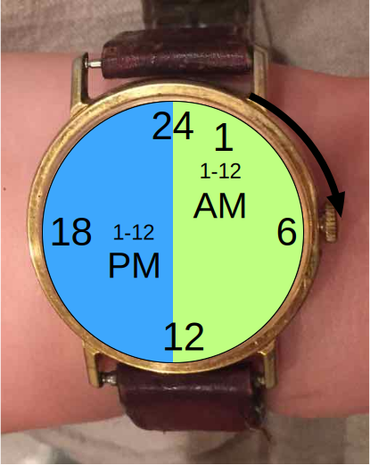
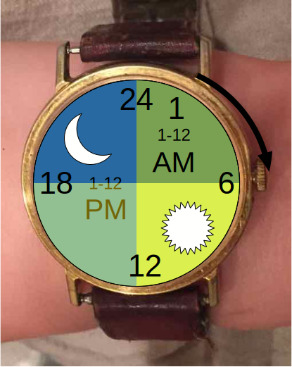
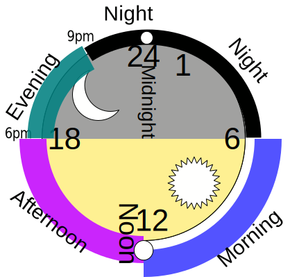
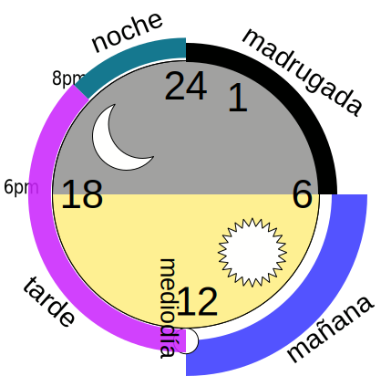

layout: true

40th Internationalization and Unicode Conference • Nov 2nd, 2016 — 
<a href="https://srl295.github.io">@srl295</a>

---
class: center, middle, whitedrop

# CLDR
## New Advanced Topics
&nbsp;
#### Steven R. Loomis, IBM
???
TITLE: CLDR New Advanced Topics

ABSTRACT: 

The Unicode CLDR has many new types of functionality added in every release. 
Join us for three informative mini-sessions as we take an in depth look at some 
of the newer features of CLDR, and how they can be used to provide more complete 
globalization of computer applications.

Topics to be covered include:

Validity Data
Day Periods
Unit Context and Usage
---

# About Me…

--
- Not John Emmons
???
--

- IBM Global Foundations Technology Team
???
We make the technologies and best practices IBM needs to support a global audience.
--

- Participant: [CLDR-TC](http://unicode.org/cldr) 
???
---
class: center, middle, whitedrop

# What is CLDR?

---

# Unicode gives you the world…

[“Unicode provides a unique number for every character,
no matter what the platform,
no matter what the program,
no matter what the language.” (unicode.org)](http://www.unicode.org/standard/WhatIsUnicode.html)

.centersml[]

###### Photo Credit: NASA Earth Observatory

---

# CLDR data brings it home…

[“The Unicode CLDR provides key building blocks for software to support the world's languages, with the largest and most extensive standard repository of locale data available.” (cldr.unicode.org)](http://cldr.unicode.org)

.centersml[]

###### Photo Credits: james.thompson,Per Ola Wiberg ~ Powi, Tom Ravenscroft

---

# Advanced Topics

- Validity Data
- Day Periods
- Unit Context and Usage

---
class: center, middle, whitedrop

# Validity Data

---

# Problem: What's a valid locale?

> Ensuring that my application can at least identify all valid language codes is important for the delivery of relevant content.

@Marvin, [stackoverflow.com/q/36089760/185799](http://stackoverflow.com/q/36089760/185799)

???
Thank you for asking that question, Marvin.
--

## Solution: Validity Data

---

# Validity Data : types

- language (`en`)
- script (`Latn`)
- region (`US`)
- subdivision (`US-CA`)
- variant (`FONIPA`)
- currency (`USD`)
- unit (`energy-kilowatt-hour`)

---

# Validity Example : Script

- **regular** : `Arab`, `Latn`, `Taml`, …
- **deprecated** : `Qaai`, …
- **special** : `Zmth`, …
- **private_use** : `Qaaa`, `Qaab`, …
- **unknown** : `Zzzz`

---

# Validity : String Range

## `Qaaa~h` → 
### `Qaa`**`b`**
### `Qaa`**`c`**
### …
### `Qaa`**`h`**

???
http://www.unicode.org/reports/tr35/#String_Range

---

# Validity : XML Example

    <supplementalData>
      <idValidity>
        <id type="script" idStatus="regular">
          Adlm Aghb Ahom …
        </id>
        <id type="script" idStatus="special">
          Zmth Zsye …
        </id>
        <id type="script" idStatus="deprecated">
          Qaai
        </id>
        <id type="script" idStatus="private_use">
          Qaaa~h Qaaj~z Qaba~x
        </id>
        <id type="script" idStatus="unknown">
          Zzzz
        </id>
      </idValidity>
    </supplementalData>

---

# Validity Data : More Info

## Spec: 
- [unicode.org/reports/tr35/#Validity_Data](http://www.unicode.org/reports/tr35/#Validity_Data)

## Data:
- [common/validity/*.xml](http://unicode.org/repos/cldr/tags/latest/common/validity/)

---
class: center, middle, whitedrop

# Day Periods

---

# Day Periods : 12 hour clock

.centersml[]
???
Here's your typical 12 hour clock
---

# Day Periods : 24 hour clock

.centersml[]
???
But let's put 24 hours on it, because there are 24 hours in a Day
---

# Day Periods : 24 hour clock

.centersml[]
???
generally, 
half of the hours are in the daylight and half in darkness
---

# Day Periods : AM/PM

.centersml[]
???
We call half of these AM and half PM
--

* AM - Ante Meridian
* PM - Post Meridian

???
If you want the Latin.
---

# Day Periods : AM/PM

.centersml[]
???
Here's AM and PM superimposed with our sunlight / darkness graph
---

# Day Periods : XML Rules

    <dayPeriodRules locales="root">
      <dayPeriodRule type="am" from="00:00" before="12:00"/>
      <dayPeriodRule type="pm" from="12:00" before="24:00"/>
    </dayPeriodRules>
    <dayPeriodRules locales="en">
      <dayPeriodRule type="midnight" at="00:00"/>
      <dayPeriodRule type="noon" at="12:00"/>
      <dayPeriodRule type="morning1" from="06:00" before="12:00"/>
      <dayPeriodRule type="afternoon1" from="12:00" before="18:00"/>
      <dayPeriodRule type="evening1" from="18:00" before="21:00"/>
      <dayPeriodRule type="night1" from="21:00" before="06:00"/>
    </dayPeriodRules>

???
Let's look at this structure on our familiar clock

http://unicode.org/repos/cldr/trunk/common/supplemental/dayPeriods.xml
---

# Day Periods : English

.centersml[]

---

# Day Periods : XML Spanish

    <dayPeriodRules locales="es">
      <dayPeriodRule type="noon" at="12:00"/>
      <!--  mediodía  -->

      <dayPeriodRule type="morning1" from="00:00" before="06:00"/>
      <!--  madrugada  -->

      <dayPeriodRule type="morning2" from="06:00" before="12:00"/>
      <!--  mañana  -->

      <dayPeriodRule type="evening1" from="12:00" before="20:00"/>
      <!--  tarde  -->

      <dayPeriodRule type="night1" from="20:00" before="24:00"/>
      <!--  noche  -->
    </dayPeriodRules>

???
Notice that the 'types' are untranslated keywords
madrugada - daybreak
---

# Day Periods : Spanish

.centersml[]

---

# Day Periods : More Details

## Spec: 
- [unicode.org/reports/tr35/tr35-dates.html#dayPeriods](http://unicode.org/reports/tr35/tr35-dates.html#dayPeriods)

## Charts:
- [unicode.org/cldr/charts/latest/supplemental/day_periods.html](http://www.unicode.org/cldr/charts/latest/supplemental/day_periods.html)

---
background-image: url(./img/unitwall2.svg)
class: center, middle, whitedrop

# Unit Context and Usage

---

# Problem: Which unit?

--
- Your destination is 85,008 yards away

--
  - 1.1439×10-5 decades

--
(with traffic)

--
- 557 albums, 2,495,941,416 milliseconds of music ♫ 

--
- According to [Wikipedia](https://en.wikipedia.org/wiki/FFF_system#Speed_of_light), The speed of light is 1.8026×1012 furlongs/fortnight.
???
What's happening here? These are all valid units,
And they may be appropriate units in your region and language.
---

# Unit Context : Length

    <unitPreferences category="length" usage="person">
      <unitPreference regions="001">centimeter</unitPreference>
      <unitPreference regions="AT BE DZ EG ES FR HK ID IL IT…">meter centimeter</unitPreference>
      <unitPreference regions="US">inch</unitPreference>
    </unitPreferences>

--
    <unitPreferences category="length" usage="rainfall">
      <unitPreference regions="001">millimeter</unitPreference>
      <unitPreference regions="BR">centimeter</unitPreference>
      <unitPreference regions="US">inch</unitPreference>
    </unitPreferences>

--
    <unitPreferences category="length" usage="vehicle">
      <unitPreference regions="001">meter</unitPreference>
      <unitPreference regions="GB US">foot inch</unitPreference>
      <unitPreference regions="MX">meter centimeter</unitPreference>
    </unitPreferences>

---

# Unit Context : More Details

## Spec: 
- [unicode.org/reports/tr35/tr35-info.html#Preferred_Units_For_Usage](http://www.unicode.org/reports/tr35/tr35-info.html#Preferred_Units_For_Usage)

---
layout: false

# Thanks/Q&A

- Social: @srl295
- Slides/Contact:  https://git.io/srl295
- Email: `srloomis` <i>@</i>  `us.ibm.com`

.bottom[made with [remark.js](http://remarkjs.com) SVG: [intaglio](https://www.purgatorydesign.com/Intaglio/index.html) • fork me on [GitHub](https://github.com/srl295/srl295-slides/tree/2016-11-02-iuc40-cldradv)]
