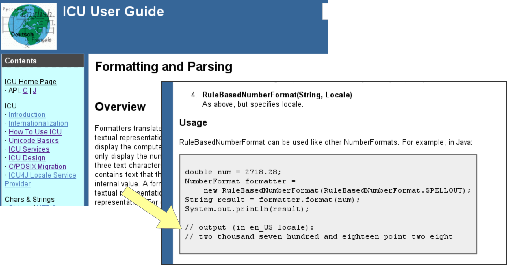
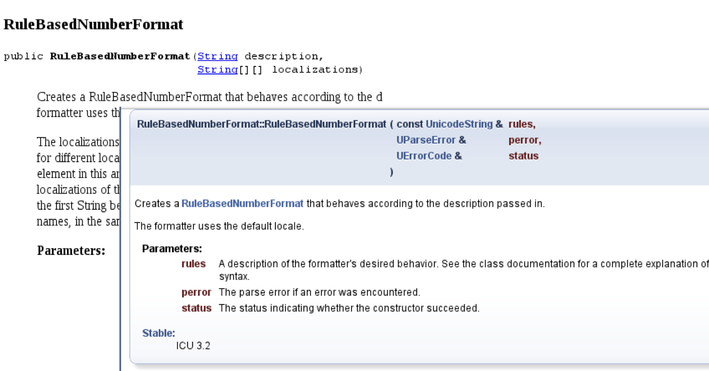
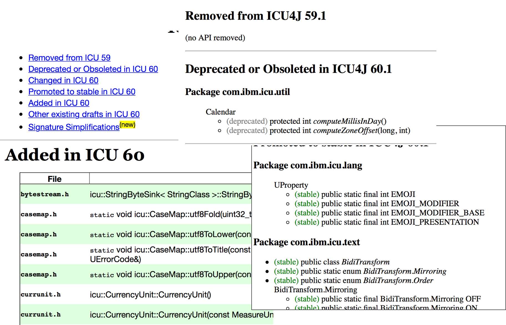
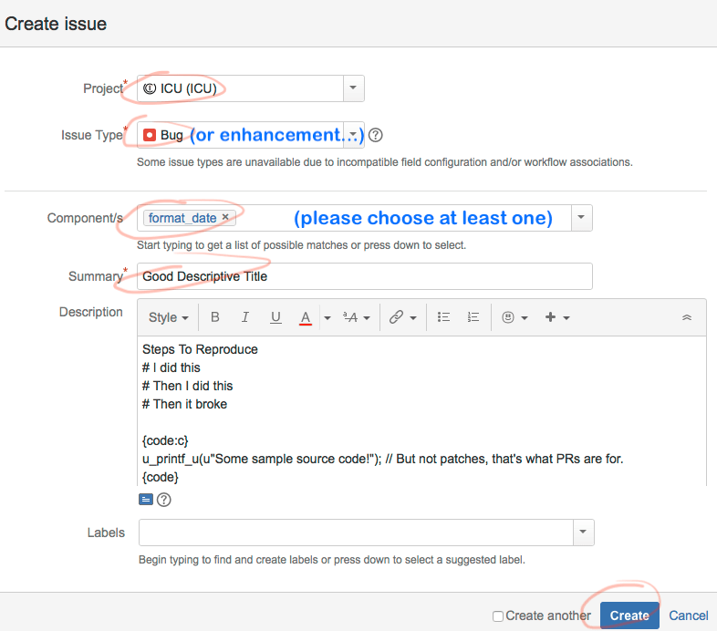
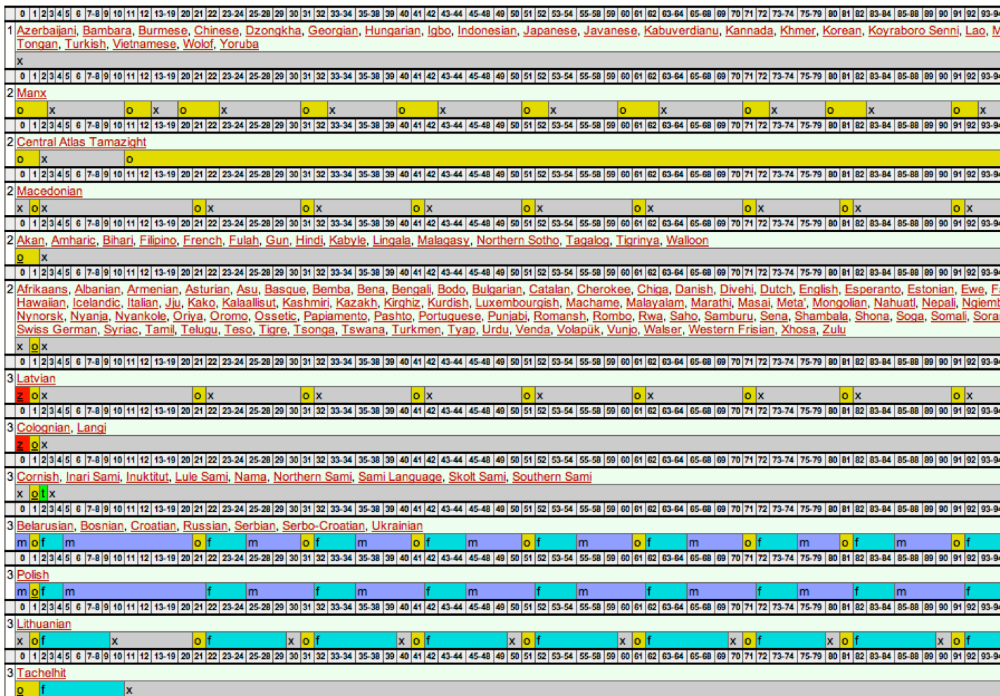
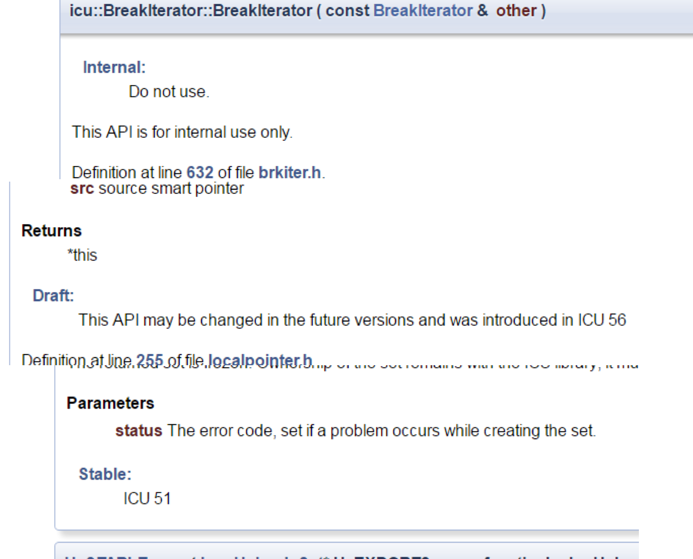
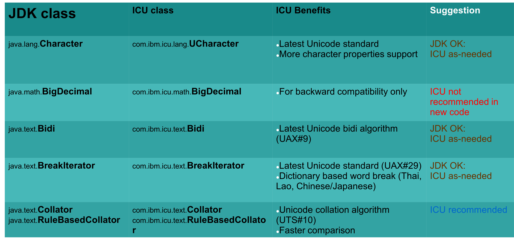
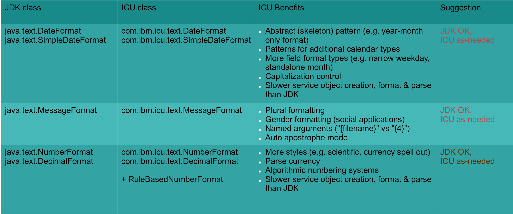

layout: true

<div class="lefttxt">Put ICU to Work!</div>
<div class="bottom">43<sup>rd</sup> Internationalization and Unicode Conference • Oct 16<sup>th</sup>, 2019 — 
<a href="https://srl295.github.io">@srl295</a></div>
---
<!-- _background-image: url(img/node1.png) -->
class: center, middle, whitedrop

.centersml[]
## Put ICU to Work!
 
#### Steven R. Loomis, IBM
#### Shane Carr, Google
???
TITLE: Put ICU to Work!

ABSTRACT: 

This tutorial gives attendees everything they need to know to get started with working with Unicode text in computer systems using the International Components for Unicode library (ICU). ICU is a very popular internationalization solution, and is hosted by Unicode itself. While it vastly simplifies the internationalization of products, there can be a learning curve.

The goal of this tutorial is to help new users of ICU install and use the library. The tutorial will walk through code snippets and examples to illustrate common usage models, followed by demonstration applications and discussion of core features and conventions, advanced techniques and how to obtain further information. It is helpful if participants are familiar with Java, C, or C++ programming. Issues relating to ICU4C/C++ as well as ICU4J (Java) will be discussed. After the tutorial, participants should be able to install and use ICU for solving their internationalization problems.

Topics include: Installation (C++ libraries, Java .jar files, Java SPI for JDK integration), verification of installation, introduction and detailed usage analysis of ICU’s frameworks (normalization, formatting with the fluent API, calendars, collation, break iteration, Unicode properties, transliteration). We will also cover the packaging of ICU data, integrating ICU into an applications development process, and how to get involved in the ICU development community.

---

# Can’t I just “use Unicode” and be done?

--

.rightmed[]

--

- 3,639 pages (core+charts)
--
 + Annexes
--

- More than 143,000 characters
--

- Significant update about once a year
--

- 80+ character properties,many multi-valued
--

- Additional standards and geopolitical requirements
 - CLDR, ISO, TZ, …
???
Locale data, new ISO language/territory changes, Time zone changes

--

- Good vs. fast

???
ICU combines up-to-date correctness with real-world performance.

---

# Unicode covers the world 🌍

- _“Unicode provides a unique number for every character,no matter what the platform,no matter what the program,no matter what the language.”_ [(unicode.org)](http://www.unicode.org/standard/WhatIsUnicode.html)

--

# ICU brings you home 🏡

- Requirements vary widely across languages & countries
- Sorting
- Text searching
- Bidirectional text processing
- Date/time/number/currency formatting
- Codepage conversion
- …many more

???


---

# I See Unicode

- 1999: _IBM Classes for Unicode_ open-sourced as the _International Components for Unicode_
- 2016: ICU joins Unicode as [ICU-TC](http://blog.unicode.org/2016/05/icu-joins-unicode-consortium.html)
- 2018: Development now on [GitHub and Jira](http://blog.unicode.org/2018/07/icu-moves-to-github-and-jira.html)
---


# ICU’s Laundry List

.leftside[
- Breaks: word, line, …
- Formatting
 - Date & time
 - Durations
 - Messages
 - Numbers & currencies
 - Plurals
- Transforms
 - Normalization
 - Casing
- Transliterations]
.rightside[
- Unicode text handling
- Charset conversions (200+)
- Charset detection
- Collation & Searching
- Locales from CLDR (640+)
- Resource Bundles
- Calendar & Time zones
- Unicode Regular Expressions
…]

---

# Benefits of ICU 

- Mature, widely used, up-to-date set of C/C++ and Java libraries
 - Basis for Java 1.1 internationalization, but goes far beyond Java 1.1
 - Team continues to work on improving and monitoring performance.
- Very portable – identical results on all platforms/programming languages
 - C/C++ (ICU4C): many platforms/compilers
 - Java (ICU4J): Oracle Java SE, IBM JRE, OpenJDK, Android
 - Wrappers: D/C#/PHP/Python/…
- Customizable & Modular
  - Open source (since 1999) – but non-restrictive
  - Contributions from many parties (IBM, Google, Apple, Microsoft, …)
- Sponsored by Unicode

---

# Where do I get ICU?

## Main site: http://icu-project.org/
- Downloads, API references, Mailing list, Bug tracking
- Userguide: http://userguide.icu-project.org
 - Moving soon to GitHub Pages
 - User’s guide with examples

---

# Prepackaged ICU

## Package Managers (C)
- `brew install icu4c`
- `apt-get install libicu-dev`
- `dnf install libicu-devel`

## Maven and friends: (J)
- group: *`com.ibm.icu`*
- artifactId: *`icu4j`*

???
The easiest way to build ICU is to let someone else build it. 

---

# [ICU Userguide](http://userguide.icu-project.org)

.centerbig[]
???
General topics and specific articles.
The User’s Guide is planned to move to Markdown, which
should make the content easier to keep up to date.

---

# [API Docs](https://unicode-org.github.io/icu-docs/#api-docs)

.centerbig[]
???
- Full class and function documentation

---

# [API Change Report](http://site.icu-project.org/download)

.centerbig[]
???
Shows which APIs were added, promoted, to stable, etc. in each release.

---

# Mailing Lists

##  http://site.icu-project.org/contacts
- `icu-support` – Technical support and discussion
- `icu-design` – API proposal discussion
- `icu-announce` – Low-volume announcements list
???
At least subscribe to the announce list so you can be notified of new ICU versions and changes.

---

# [Issues (Jira)](http://site.icu-project.org/bugs)

.centerbig[]
---

# Contributing

1. Open an [issue](http://site.icu-project.org/bugs) in Jira
2. [Fork](https://github.com/unicode-org/icu/fork) the ICU repo
3. Write and test your code
4. Commit your change to your fork
5. Open a [new Pull Request](https://github.com/unicode-org/icu/pull/new/master)
6. Sign the CLA when prompted [](https://cla-assistant.io/unicode-org/icu)
--

7. Bask in your newfound fame and fortune!

---
class: center, middle

# And now, `code`

---

# Task at Hand

- _Display a list of world regions, with their population figures_
--

## Example
- 150,000: Ceuta and Melilla
- 38,087,800: Algeria
- 15,439,400: Ecuador

???
How do we display this in an international way
---
name: firstlook

# ICU4C First Look

```c
#include <unicode/…>

void func() {
  UErrorCode status = U_ZERO_ERROR;
  u_init(&status);
  if ( U_SUCCESS(status) ) { /* … */ }
}
```
---
template: firstlook

### `#include <unicode/…>`
- All ICU headers are in the `unicode/` subdirectory
---
template: firstlook

### `UErrorCode status = U_ZERO_ERROR;`
- Error code is a fill-in, but must be initialized
- If in C++, `icu::ErrorCode` is available (example on next slide)
---
template: firstlook

### `u_init(&status);`
- Returns successful `status` if ICU data loaded OK
---
template: firstlook

### `if ( U_SUCCESS(status) )`
- TRUE if there was no error
---

# Error codes in C++

No need to initialize!  Less prone to error:

```cpp
#include <unicode/…>

int main() {
  icu::ErrorCode status;
  u_init(status);
  if (status.isFailure()) {
    return 1;
  }
  return 0;
}
```

---

# `ASSERT_OK()`

C++ version:

```cpp
#define ASSERT_OK(status) \
 if(status.isFailure()) { \
     puts(status.errorName()); \
     return 1; \
 }
```

Plain C version:
```c
#define ASSERT_OK(status) \
 if(U_FAILURE(status)) { \
     puts(u_errorName(status)); \
     return 1; \
 }
```

--

- always check for failure
--

- (We will use this macro to keep test code more compact)

---

# s09_test.c

```c
#include <unicode/ustdio.h>

int main(int argc, const char *argv[]) {
    u_printf_u(u"This is ICU %s! 😼\n", U_ICU_VERSION);
    return 0;
}
```
--

# `This is ICU 64.2! 😼`
--

- _but, let’s actually build this_
---

# Building `s09_test.c`

```shell
$ brew install icu4c pkg-config
```
--

```shell
$ git clone https://github.com/unicode-org/icu-demos.git -b iuc43
```
???
on mac…

--

```shell
$ cd iucsamples/c/s09_test
$ make check
This is ICU 64.2! 😼
everything is OK 🎉
```
--

### under the hood:

- paths detected via pkg-config
```shell
cc -I/usr/local/Cellar/icu4c/64.2/include -o s09_test s09_test.c -L/usr/local/Cellar/icu4c/64.2/lib -licuio -licui18n -licuuc -licudata
```
---
name: icuhelloworld.c

# `s13a_hello.cpp`

```c
#include <unicode/errorcode.h>
#include <unicode/locid.h>
#include <unicode/ustdio.h>
#include <unicode/ustream.h>
#include <iostream>

int main() {
  icu::ErrorCode status;
  icu::Locale locale("und_001");
  icu::UnicodeString world;
  locale.getDisplayCountry(world);
  ASSERT_OK(status);

  std::cout << "Hello, " << world << "!" << std::endl;
  return 0;
}
```
---
template: icuhelloworld.c

# `Hello, World!`
---
template: icuhelloworld.cpp

```shell
$ LC_ALL=es ./s13a_hello
```

# `Hello, Mundo!`
---

# `icuhelloworld.cpp`

```shell
$ LC_ALL=mt ./s13a_hello
```
## Hello, Dinja!
```shell
$ LC_ALL=zh ./s13a_hello
```
## Hello, 世界!
---
class: center, middle

# 🙀
???
What are we doing?!
--
What if we want to change **“Hello”**?

---

# String Concatenation 🙀

- Order is different for different languages, can't just concatenate strings.
--


### My .xa[Aunt’s] .xb[pen] is on the table.
--

```js
whom + "’s " + what + " is on the " + where
```
--

### La .xb[pluma] de .xa[mi tía] está sobre la mesa.
---

# Pattern Syntax

--
### `en:` .xa[`{whom}`]`’s` .xb[`{what}`] `is on the {where}.`
--

### `es:` .xb[`{what}`] `de` .xa[`{whom}`] `está sobre la {where}.`
--

## Or, avoid sentences entirely

### “Location: table, Object: pen, Owner: Aunt”

---
name: hellomsg.cpp

# `hellomsg.cpp` 

```c
    const int kArgCount = 1;
    Formattable   arguments[kArgCount] = { world };
    UnicodeString argnames[kArgCount]  = {"world"};
    FieldPosition fpos = 0;
```
???
one argument
---
template: hellomsg.cpp

```c
    MessageFormat msg_en("Hello, {world}", 
        Locale("en"), status);
    UnicodeString result_en;
    msg_en.format(argnames, arguments, kArgCount, result_en, status);
    ASSERT_OK(status);
    std::cout << "en: " << result_en << std::endl;
```
### `en: Hello, World`

---
template: hellomsg.cpp

```c
    MessageFormat msg_es("¡Hola, {world}!",
        Locale("es"), status);
    UnicodeString result_es;
    msg_es.format(argnames, arguments, kArgCount, result_es, status);
    ASSERT_OK(status);
    std::cout << "es: " << result_es << std::endl;
```
### `es: ¡Hola, Mundo!`

---

# Java
--
(ICU4J)
---

# ICU4J : Hello, Maven

```xml
		<dependency>
			<groupId>com.ibm.icu</groupId>
			<artifactId>icu4j</artifactId>
			<version>64.2</version>
		</dependency>
```

---

# `Hello.java`

```java
  Locale locale = Locale.getDefault();
  String world = LocaleDisplayNames
          .getInstance(ULocale.forLocale(locale))
          .regionDisplayName("001");
  System.out.println("Hello, " + world + "\u2603");
```

### `Hello, World☃`

---

# `Hello.java` (español)

```java
  Locale locale = Locale.forLanguageTag("es");
  String world = LocaleDisplayNames
          .getInstance(ULocale.forLocale(locale))
          .regionDisplayName("001");
  System.out.println("Hello, " + world + "\u2603");
```

### `Hello, Mundo☃`
--

- use `java.util.Locale`
--

- …except for some ICU4J APIs that still use ICU’s `ULocale`
---

# `BadMessage.properties`

```properties
population=The territory of {territory} has {population} persons.
```
---
name: BadMessage.java

# `BadMessage.java`

```java
        final Locale locale = Locale.getDefault();
        ResourceBundle rb = ResourceBundle.getBundle(BadMessage.class.getName());
        String popmsg = rb.getString("population");
        System.out.println("Message: " + popmsg);

        for(final PopulationData.TerritoryEntry entry :
           PopulationData.getTerritoryEntries(locale)) {
            MessageFormat m = new MessageFormat(popmsg, locale);
            Map msgArgs = new HashMap<String,Object>();
            msgArgs.put("territory", entry.territoryName());
            msgArgs.put("population", entry.population());
            System.out.println(m.format(msgArgs));
        }
```
---
template: BadMessage.java

```
Message: The territory of {territory} has {population} persons.
The territory of Afghanistan has 34,124,800 persons.
The territory of Albania has 3,047,990 persons.
The territory of Algeria has 40,969,400 persons.
```

 - ok so far
---
template: BadMessage.java

```
The territory of Bouvet Island has 1 persons.
The territory of Unknown Region has 0 persons.
```

- Not so OK!
--

.righttiny[]
---

# CLDR Plurals

--

 - English: 0 dogs, 1 dog, 2 dogs, 3 dogs, 4 dogs
--

 - Welsh: 0 cŵn, 
???
kun
--
1 ci, 
???
ki
--
2 gi, 
???
--
3 ci, 
???
--
4 ci
???
--

---

# CLDR Plurals

.centerbig[]

---

# `GoodMessage.properties`

```properties
population={population, plural, 
  one{The territory of {territory} has # person}
  other{The territory of {territory} has # persons}}
```
--

- no code change
--

```
The territory of United States has 323,996,000 persons
The territory of Unknown Region has 0 persons
The territory of Uruguay has 3,351,020 persons
The territory of Botswana has 2,209,210 persons
The territory of Bouvet Island has 1 person
The territory of Brazil has 205,824,000 persons
```

---

# Units and Currencies

```txt
The room measures
{0, plural, one{1 meter} other{# meters}}
wide.
```

```
The room measures 0 meters wide.
The room measures 1 meter wide.
The room measures 0 meters wide.
```

But with ICU message strings, ICU can handle measurement units without having to enumerate all the plural forms yourself!

Use the "number" type instead of "plural" type and pass a number skeleton:

```txt
The room measures
{0, number, ::measure-unit/length-meter unit-width-full-name}
wide.
```

Also works for currencies.

*Sample code: s88_units.cpp*

???
Try:

```
$ env LC_ALL=el make check
./s88_units
The room measures 1 meter wide.
The room measures 5 meters wide.
The room measures 1 μέτρο wide.
The room measures 5 μέτρα wide.
```

---

# Compact Notation


Programmatically:

```cpp
std::cout
  << icu::number::NumberFormatter::with()
    .notation(icu::number::Notation::compactShort())
    .locale("en-us")
    .formatDouble(quantity, status)
    .toString(status)
  << std::endl;
```

Via Message String:

```
{0, number, ::compact-short}
```

*Sample code: s99_compact.cpp*

---

# Break Iteration

- Unicode standards + tailoring
- [UAX#14 line breaking](https://www.unicode.org/reports/tr14/)
- [UAX#29 sentence, grapheme cluster, word](https://www.unicode.org/reports/tr29/)

---

# Break Iteration Sample

```c

  BreakIterator *wordIterator = BreakIterator::createWordInstance(locale, status);
  breakIterator->setText(u"Hello World");
  breakIterator->current(); // 0
  breakIterator->next(); // 5
  breakIterator->next(); // 6
  breakIterator->next(); // 11
  breakIterator->next(); // -1 == DONE

```

Sample: `s23_brki.cpp`

---


# Collators (Text Sorting)
 
- binary comparison inadequate
- order varies by language (Danish ‘aa…’ follows ‘z…’)
- need multiple-level collation

.leftside[## Uses:
 - comparing
 - sorting
 - searching]
.rightside[## Options:
 - case sensitive?
 - ignore punctuation?
 - UPPERCASE first?
 - which variant collator?
 - which locale?
 - custom tailorings?
 - time vs. memory tradeoff?]

---

# `CollateMessage.java`

```java
        Collator col = Collator.getInstance(locale);
        for(final PopulationData.TerritoryEntry entry :
         PopulationData.getTerritoryEntries(locale,
                new TreeSet<>((o1, o2) 
                -> col.compare (o1.territoryName(), o2.territoryName())))) {
                    …
```
--

* No Lambda function needed if `Set<String>`

---

# Multilingual

### Russian
```
The territory of Аландские о-ва has 26 200 persons in it.
The territory of Албания has 3 011 410 persons in it.
```

### Japanese
```
アイスランドには、315,281人います。
アイルランドには、4,775,980人います。
```

### Spanish
```
En la región de “Afganistán” hay 31.108.100 personas.
En la región de “Albania” hay 3.011.410 personas.
En la región de “Angola” hay 18.565.300 personas.
```
---

# API Stability

- `Internal`: Used by ICU implementation or Technology Preview.
--

- `Draft`: New API, reviewed and approved by ICU project team. The API might be still changed.
--

- `Stable`: For public use, the API signature won’t be changed in future releases.
--

- `Deprecated`: Previously Stable, but no longer recommended. The API might be removed after a few releases.

--

### More details:

- [userguide.icu-project.org/design](http://userguide.icu-project.org/design#TOC-ICU-API-compatibility)
---

# API Stability in docs

.centermed[]
---

# Binary Stability

## Source code compatible
- Consumer program should be compiled successfully without changes.
- Rare exceptions, documented in readme.

## Serialization compatible (ICU4J)
- Newer ICU version should be able to deserialize object data serialized by older ICU version.
- (see docs for limited exceptions)
---

# ICU Data File

- aka, `icudt64l.dat`
- 20MB+ of data to support ICU's features
--

.centermed[]

---

# Packaging
--
_“It’s too big”_
--

ICU 64 Data Build Tool

- Slice data by feature and locale
- [Read the Docs](https://github.com/unicode-org/icu/blob/master/docs/userguide/icu_data/buildtool.md), and attend Shane's session tomorrow

Other Customization

- Repackage ICU data http://userguide.icu-project.org/icudata
- Repackage ICU4C Code http://userguide.icu-project.org/packaging

 Example: `#define UCONFIG_NO_LEGACY_CONVERSION`
 - (Note: removes code but not data)

---

# Data Changes

.centerbig[]

---

# Data Stability

## Unicode stability

--

- character type, upper/lower case, normalization, text direction, sorting order...
--

- policy http://www.unicode.org/policies/stability_policy.html
--

- Unicode is still growing.
--


## Locale data
--

- cultural data can be updated based on community voting
--

- cultural format results are not suited for serializing data, application protocols and storage

---

# Stability Problems

--

- “`08-04-2019`” may not parse as “`8 kwi 2019`”
--

- DON’T send localized data across the network between programs
--
(other side may parse/format differently)
--

- DON’T store localized data on disk
--
( later app version may parse/format differently)]
--

- DO send and store non-localized format
 - Binary: 0x12345678
 - “Neutral” - ISO 8601 - “`2019-04-08`”
--

- REMEMBER ॳ may not be a letter
???
U+0973
--
(isLetter()) in one Unicode version, but may later be defined.
--
Could cause difficulties if used to validate account names, …
???
Spotify
--

- DO Think carefully about where Unicode properties are used.
---

# ICU4J vs JDK `(0/2)`

- ICU has functionality beyond JDK - See userguide.
--

- Where there is overlap, in some cases JDK may be used instead of ICU.
--
 Example: `Locale` instead of ICU’s ULocale
---

# ICU4J vs JDK `(1/2)`

.centerhuge[]

---

# ICU4J vs JDK `(2/2)`

.centerhuge[]

---
layout: false

### Action for You: Join our mailing lists!


--

<hr/>

)

#### Presenter: Steven Loomis

- Social: @srl295
- Web site: [git.io/srl295](https://git.io/srl295)
- Email: `srloomis`<i>@</i>`us.ibm.com`

#### Presenter: Shane Carr

- Social: @sffc or @_sffc
- Web site: [https://sffc.xyz](https://sffc.xyz)
- Email: `sffc`<i>@</i>`google.com` / `shane`<i>@</i>`unicode.org`

Have a nice day!


.bottom[made with [remark.js](http://remarkjs.com) • fork me on [GitHub](https://github.com/srl295/srl295-slides/tree/2019-09-16-iuc43-icuwork-s1t3)]
